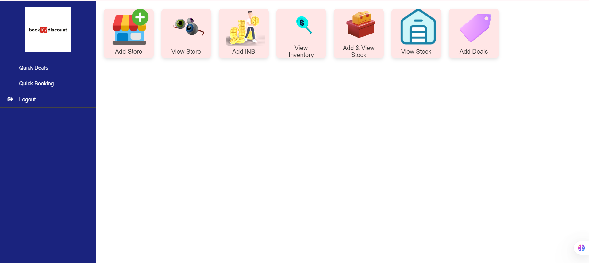

# BookMyDiscount.com



BookMyDiscount.com is a PHP-based project designed to provide users with information about discounted deals and offers. This project utilizes PHP, Hack, and CSS.

## Features
- Listing of discounted products and services
- User-friendly interface
- Offer search and filter options
- Admin panel for product/offer management

## Technology Stack
- **Backend:** PHP, Hack
- **Frontend:** CSS
- **Database:** MySQL (expected)
- **Web Server:** Apache/Nginx (recommended)

## Installation
1. Clone this repository:
   ```bash
   git clone https://github.com/rakeshsaunr/bookmydiscount.com.git
   ```
2. Place the project files in your web server's root directory.
3. Make sure PHP and MySQL are installed.
4. Set up the database (import schema file if provided).
5. Update your database details in `config.php` or `.env`.
6. Open the project in your browser:  
   ```
   http://localhost/bookmydiscount.com
   ```

## Contribution
- Send suggestions and improvements via Pull Requests or Issues.
- Please follow the coding style and guidelines.

## License
This project is open source. See the LICENSE file for details.

---

**Contact:**  
If you have any questions or suggestions, please post them on [GitHub Issues](https://github.com/rakeshsaunr/bookmydiscount.com/issues).
